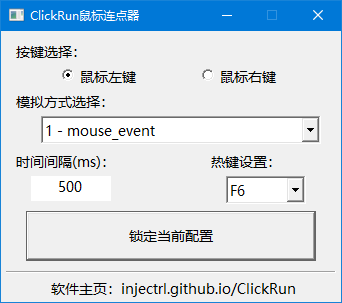

# ClickRun

> 简单易用的鼠标连点器，优化了一些原版存在的问题：
> - 两次重复的 EnableWindow(hRadio_Left, TRUE)
> - SendInput 合并为单次数组调用
> - 线程句柄泄漏（从未 CloseHandle）
> - 配置写入 HKLM 需要管理员权限
> - 代码调整

## 说明

- [x] 连点鼠标左键、右键

- [x] SendInput与Mouse_Event两种API实现模拟点击

- [x] 可选F1~F12作为连点启停热键

- [x] 程序启动时尝试读取历史配置信息，锁定当前配置后记录本次配置信息到注册表

- [x] 自定义两次点击的时间间隔